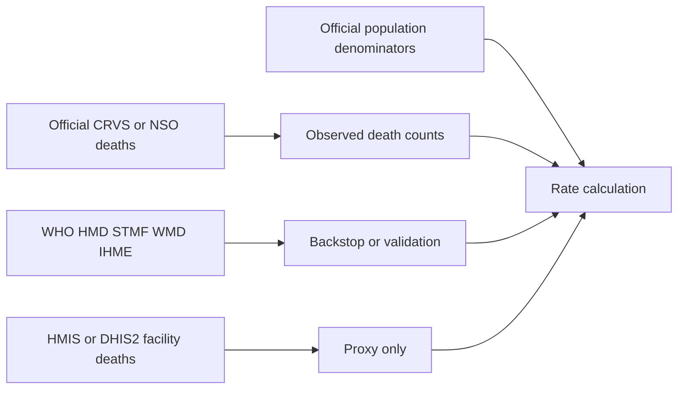

# Subnational and Subyearly Mortality Data Access Across Sixteen Countries

## Executive summary

The landscape is uneven. Only **Canada, Australia, Mexico, and South Africa** currently offer genuinely useful official mortality series at **subyearly** resolution with at least some **subnational** detail that can be downloaded without bespoke permissions. Canada is the strongest case in this set because Statistics Canada exposes weekly provincial/territorial deaths, monthly provincial/territorial deaths, and an unauthenticated API. Australia is similarly strong through ABS provisional mortality dashboards with weekly and monthly death series by state or territory, plus a formal SDMX API ecosystem. Mexico is strong for annual subnational microdata and strong-but-specialized for weekly state-level excess-mortality files; the weekly piece is not a clean CRVS “all deaths by week” table, but it is official, state-level, and directly downloadable. South Africa is useful through the SAMRC’s monthly release of estimated **weekly** deaths, including provincial and metro views, but this is a surveillance/estimation product built from the National Population Register rather than a simple raw CRVS extract. citeturn44search5turn44search6turn26view0turn34search0turn29search3turn25search0turn38view0turn35search0turn36search2

A second tier consists of **Türkiye, Egypt, and Algeria**. Türkiye has official monthly deaths for the current year and annual subnational death tables, but I did **not** find a stable public official series that is simultaneously subnational and subyearly. Egypt and Algeria have official monthly or quarterly publications and annual subnational vital statistics, but again I did not verify a routine public source that delivers subnational death counts at weekly or monthly resolution. These countries are still analytically usable, but not in the frictionless, machine-readable way you asked for. citeturn7search0turn7search5turn17view6turn31search6turn31search7turn32search2turn32search12

For **China, Pakistan, India, Indonesia, Ethiopia, Nigeria, Democratic Republic of the Congo, Madagascar, and Libya**, I did not find a routine public official source that provides **all-cause mortality** at both **subnational** and **subyearly** resolution. In these cases, the best official options are usually annual CRVS or yearbook tabulations; the best subyearly substitutes are often **facility-based HMIS/DHIS2 systems**, which are timely and geographically detailed but are **not population-complete all-cause mortality systems**. For rigorous comparative work, the defensible workflow is: use official annual subnational deaths when available, use official subnational annual or monthly population denominators, interpolate to weekly/monthly denominators, and if subyear death timing is missing, explicitly model the within-year distribution rather than presenting imputed series as observed data. citeturn18search2turn19search0turn24search1turn23search0turn21search3turn20search2turn13search3turn37search1turn23search3turn23search1

Across the international backstops, the division is clear. **WHO Mortality Database** is authoritative but mostly **annual** and country-level, albeit with raw downloadable files. **HMD/STMF** is the best international weekly source in this set but effectively helps you only for **Canada and Australia** among the countries you listed, and HMD access requires registration. **World Mortality Dataset** is easy to download and includes only countries with weekly/monthly/quarterly national mortality, but it is **country-level only** and explicitly does **not** split by regions. **IHME GBD** is valuable for modeled annual subnational mortality, but it is not a source of observed weekly or monthly CRVS data. citeturn40view0turn39search1turn39search3turn39search6turn41view0turn0search3

## Availability at a glance

The table below focuses on the **best currently findable public source** for your exact use-case: subnational plus subyearly mortality, or the closest official alternative when such a source was not found.

| Country                          | Weekly                                  | Monthly                                            | Quarterly                 | Public subnational + subyearly all-cause mortality found            | Direct API                                                                     | Best source URL                                                                                                                                   |
| -------------------------------- | --------------------------------------- | -------------------------------------------------- | ------------------------- | ------------------------------------------------------------------- | ------------------------------------------------------------------------------ | ------------------------------------------------------------------------------------------------------------------------------------------------- |
| Canada                           | Yes                                     | Yes                                                | No                        | **Yes**                                                             | **Yes**                                                                        | `https://www150.statcan.gc.ca/n1/en/catalogue/1310076801` citeturn44search5turn44search6turn26view0                                          |
| Australia                        | Yes                                     | Yes                                                | No                        | **Yes**                                                             | **Yes**                                                                        | `https://www.abs.gov.au/statistics/health/causes-death/provisional-mortality-statistics/latest-release` citeturn34search0turn29search3        |
| Mexico                           | Yes                                     | Annual microdata + excess datasets                 | No                        | **Partly**                                                          | No routine mortality API                                                       | `https://www.dgis.salud.gob.mx/contenidos/basesdedatos/da_exceso_mortalidad_mexico_gobmx.html` citeturn25search0turn38view0                   |
| South Africa                     | Yes                                     | Monthly releases of weekly series                  | No                        | **Yes, via surveillance estimates**                                 | No                                                                             | `https://www.samrc.ac.za/research-reports/report-weekly-deaths-south-africa` citeturn35search0turn36search2                                   |
| Türkiye                          | No verified public subnational weekly   | National monthly                                   | No                        | **No**                                                              | Portal/API ecosystem, but no verified public subnational monthly deaths series | `https://biruni.tuik.gov.tr/medas/?kn=114&locale=en` citeturn17view6turn8search1turn12view0                                                  |
| Egypt                            | No                                      | National monthly                                   | No                        | **No**                                                              | No                                                                             | `https://www.capmas.gov.eg/Pages/Publications.aspx?page_id=5107&Year=23518` citeturn16view0turn31search6turn31search7                        |
| Algeria                          | No                                      | No public machine-readable monthly series verified | Quarterly bulletin exists | **No**                                                              | No                                                                             | `https://www.ons.dz/IMG/pdf/Demographie_Alg2020_2023.pdf` citeturn17view1turn32search2turn32search12                                         |
| India                            | No                                      | HMIS rural facility deaths monthly                 | No                        | **Only facility-based alternative; 2019 state/UT extract obtained** | Keyed OGD API; open CKAN mirror (neither is CRVS)                              | `https://www.data.gov.in/catalog/health-indicator-wise-monthly-datasets-sub-district-level-hmis`                                                  |
| Indonesia                        | No                                      | Not found publicly for all-cause deaths            | No                        | **No**                                                              | No public mortality API found                                                  | `https://www.bps.go.id/en/publication/2024/10/17/f3eaad9790e201d758f8b34c/indonesias-vital-statistics-report-2019-2023.html` citeturn24search1 |
| China                            | No                                      | No public routine series found                     | No                        | **No**                                                              | No public mortality API found                                                  | `https://data.stats.gov.cn/` citeturn13search3turn37search1                                                                                   |
| Pakistan                         | No                                      | No public routine series found                     | No                        | **No**                                                              | No public mortality API found                                                  | `https://pc.gov.pk/web/crvs` citeturn20search5turn20search2turn18search3                                                                     |
| Ethiopia                         | No                                      | No open all-cause CRVS series found                | No                        | **No**                                                              | Login-only HMIS                                                                | `https://dhis.moh.gov.et/dhis-web-commons/security/login.action` citeturn23search0turn23search1                                               |
| Nigeria                          | No public all-cause weekly/monthly CRVS | State-level health dashboards, not all-cause CRVS  | No                        | **No**, except program-specific mortality dashboards                | Login/public dashboard, not CRVS API                                           | `https://crvs.nationalpopulation.gov.ng/` citeturn21search4turn21search3turn22search19                                                       |
| Democratic Republic of the Congo | No                                      | Not found publicly                                 | No                        | **No**                                                              | No                                                                             | `https://data.unicef.org/crvs/democratic-republic-congo/` citeturn23search3                                                                    |
| Madagascar                       | No                                      | Not found publicly                                 | No                        | **No**                                                              | No                                                                             | Best practical international fallback: WHO / IHME annual sources citeturn40view0turn0search3                                                  |
| Libya                            | No                                      | Not found publicly                                 | No                        | **No**                                                              | No                                                                             | Best practical international fallback: WHO / IHME annual sources citeturn40view0turn0search3                                                  |

## Retrieval framework

The cleanest analytic workflow is to prefer official CRVS or NSO sources first, then add international backstops only when the official source is missing, inaccessible, or not sufficiently granular. In practice, for this country set the source hierarchy looks like this: official weekly/monthly death counts if they exist; annual official CRVS plus official annual population if they do not; international annual backstops from WHO/UN/IHME when the national portal is incomplete; and only then facility-based HMIS/DHIS2 mortality indicators as a proxy, with very explicit caveats that those are not complete all-cause mortality. citeturn40view0turn39search1turn41view0turn19search0turn21search3



For download mechanics, the important distinction is between **resource pages** and **machine endpoints**. Statistics Canada and ABS expose formal API machinery. Mexico, South Africa, CAPMAS, ONS, and most of the lower-access countries are still primarily **portal-plus-file-download** ecosystems. WHO Mortality Database sits in between: the landing page is human-readable, but the downloadable raw files are direct ZIP assets intended for institutional users rather than a pleasant web table. HMD/STMF also has downloadable files, but HMD access still requires registration. citeturn26view0turn29search3turn40view0turn39search3

## Countries with strong official access

### Canada

**Official sources.** Statistics Canada provides two directly relevant products: **table 13-10-0768-01**, “Provisional weekly death counts, by age group and sex,” with province and territory availability; and **table 13-10-0708-01**, “Deaths, by month,” which provides monthly deaths by place of residence. Statistics Canada also maintains an interactive “Provisional weekly death counts” tool that explicitly says users can explore weekly trends for each province and territory, with age group and sex. An additional official open dataset provides the adjusted weekly estimates, expected numbers, and excess mortality framework by province and territory. citeturn44search5turn44search6turn44search2turn44search11

**Best dataset URLs and API.** Use the catalogue pages as stable anchors: `https://www150.statcan.gc.ca/n1/en/catalogue/1310076801` for weekly deaths and `https://www150.statcan.gc.ca/n1/en/catalogue/1310070801` for monthly deaths. The official API is the Web Data Service documentation hub, `https://www.statcan.gc.ca/en/microdata/api`, with WDS method details at `https://www.statcan.gc.ca/en/developers/wds/user-guide`. The documented full-table endpoint pattern is `https://www150.statcan.gc.ca/t1/wds/rest/getFullTableDownloadCSV/{productId}/{language}`. citeturn44search5turn44search6turn26view0turn27search0turn27search10

**Step-by-step access.** For web UI, open the catalogue page, choose variables in the table interface if you want a filtered extract, or use the download option for the full CSV/ZIP. For API access, first issue the WDS full-table request with the product ID, then download the ZIP file returned in the JSON response, and finally unzip the data and metadata files locally. For weekly provincial deaths, the working product ID is `1310076801`; for monthly deaths, `1310070801`. Statistics Canada describes WDS as the preferred mechanism for harvesting discrete data points and full-table downloads, and the WDS guide documents both JSON and SDMX outputs. citeturn26view0turn27search0turn27search14turn27search10

```bash
curl -s "https://www150.statcan.gc.ca/t1/wds/rest/getFullTableDownloadCSV/1310076801/en"
```

An illustrative response has the documented WDS structure: a JSON object with a status field and a temporary download URL in `object`; the returned URL points to a ZIP file containing the CSV plus metadata. That is the cleanest official API pattern in this entire country set. citeturn26view0turn27search10

**Metadata, coverage, and limits.** Geography is Canada plus provinces and territories. Temporal resolution is weekly for the provisional table and monthly for the monthly deaths table. Weekly data are provisional and revised because provincial and territorial registries report with lags; the adjusted weekly estimates are specifically intended to account for undercoverage and delay. Age and sex detail are available in the weekly table. For monthly deaths, geography is by place of residence. Licensing/reuse follow Statistics Canada and Open Government dissemination terms; check the table page or Open Government entry before republishing derivative files. citeturn44search5turn44search6turn44search11turn26view0

### Australia

**Official sources.** The Australian Bureau of Statistics’ **Provisional Mortality Statistics** release is the key source. ABS states that a time series of **weekly and monthly deaths occurring from 2015** is available in the data downloads section, and that customized datasets can be created from the data cubes. The publication also offers age-standardised death rates in the download area. citeturn33search0turn33search4turn33search8

**Best dataset URLs and API.** The stable publication hub is `https://www.abs.gov.au/statistics/health/causes-death/provisional-mortality-statistics/latest-release`. A direct workbook example for the latest monthly dashboard is `https://www.abs.gov.au/statistics/health/causes-death/provisional-mortality-statistics/jan-feb-2026/Provisional%20Mortality%20Statistics%2C%20Monthly%20Dashboard%2C%20Jan%20-%20Feb%202026.xlsx`. The ABS Data API documentation is at `https://www.abs.gov.au/statistics/application-programming-interfaces-apis/data-api-user-guide`, and the SDMX dataflow listing endpoint is `https://data.api.abs.gov.au/rest/dataflow/all?detail=allstubs`. citeturn34search0turn34search2turn29search3turn29search10

**Step-by-step access.** For web UI, start at the latest-release page, open **Data download**, and download the **Weekly Dashboard** and **Monthly Dashboard** workbooks; those files are the easiest way to get state/territory time series. For API use, start with the ABS Data API dataflow listing, identify the relevant mortality dataflow, then either use Data Explorer to generate the exact SDMX query or construct it manually using the documented dataset/data-key pattern. ABS explicitly recommends Data Explorer’s **Developer API** tab for generating exact calls. The Data API is open; by contrast, the smaller ABS Indicator API requires a key. citeturn34search0turn34search1turn29search3turn29search7turn29search16turn29search19

```bash
curl -s "https://data.api.abs.gov.au/rest/dataflow/all?detail=allstubs"
```

The dataflow response is an SDMX structure listing datasets. Once the mortality dataflow is identified, the actual data call will return CSV, JSON, or XML depending on the requested format. ABS documents the Data API as SDMX 2.1 compliant and available in XML, JSON, and CSV. citeturn29search2turn29search3turn29search7

**Metadata, coverage, and limits.** Geography is Australia and its states/territories in the dashboards. Temporal resolution is weekly and monthly; time coverage in the provisional mortality series runs from 2015 onward. The workbook metadata indicate breakdowns by age group, males/females, and state or territory of registration. The biggest limitation is that these are provisional deaths and ABS warns they are not directly comparable to finalized “Deaths, Australia” releases and are subject to continuous revision and quality improvement. citeturn34search0turn34search2turn33search13

### Mexico

**Official sources.** Mexico has two separate official assets that matter here. First, the **Registro de defunciones** open-data catalogue exposes annual registered-deaths microdata files in CSV, with variables including federal entity, cause of death, sex, age, occupation, marital status, and other death-event fields. Second, the Ministry of Health’s DGIS publishes the **Exceso de Mortalidad en México** database; the landing page states that the source is the National Civil Registry Database managed by RENAPO across the 32 federal entities. That second source is the one that gets you closest to weekly subnational mortality. citeturn38view0turn25search0

**Best dataset URLs and files.** The annual microdata landing page is `https://www.datos.gob.mx/dataset/registro_defunciones`. The excess mortality page is `https://www.dgis.salud.gob.mx/contenidos/basesdedatos/da_exceso_mortalidad_mexico_gobmx.html`. A directly indexed ZIP example is `http://www.dgis.salud.gob.mx/descargas/datosabiertos/excesoMortalidad/Exceso_Mortalidad_MX_2023.zip`. citeturn38view0turn25search0turn25search13

**Step-by-step access.** For annual official microdata, open the `registro_defunciones` dataset page and choose the year-specific CSV download. For weekly state-level excess mortality, open the DGIS excess-mortality page and download the ZIP file linked for the relevant year. The annual microdata page is straightforward and clearly marked as CSV; the DGIS page is also a direct open-data download without authentication. Mexico’s open-data catalogue states the death-registration dataset is under **Creative Commons Attribution 4.0**. citeturn38view0turn25search0turn25search2

```bash
curl -L -o Exceso_Mortalidad_MX_2023.zip \
  "http://www.dgis.salud.gob.mx/descargas/datosabiertos/excesoMortalidad/Exceso_Mortalidad_MX_2023.zip"
```

The annual death-registration files are CSV; the excess-mortality bundles are ZIP archives that unpack to tabulations suitable for state-by-week analysis. The crucial limitation is conceptual: the DGIS excess product is an official surveillance dataset built from civil-registry feeds for excess-mortality estimation, not a single canonical week-by-week all-cause death microfile by municipality. citeturn38view0turn25search0turn25search13

**Metadata, coverage, and limits.** Annual microdata are highly granular geographically and demographically, but not subyearly. The excess-mortality dataset is subnational and weekly at state level, tied to the 32 entities. The annual files include sex, age, and cause variables; the excess files are designed for surveillance and comparison with expected values. Licensing is clear on the `datos.gob.mx` page for the annual registry files. For rates, use state-year or state-midyear population denominators from INEGI or CONAPO and align them to epidemiological weeks. citeturn38view0turn25search0

### South Africa

**Official sources.** South Africa’s practical source is the SAMRC **Report on Weekly Deaths in South Africa**. SAMRC describes it as a **monthly reporting of weekly deaths**, based on deaths recorded in the National Population Register and adjusted for people not on the register and for deaths not yet registered with the Department of Home Affairs. Search-indexed report text also shows a province-and-metro table for excess deaths. citeturn35search0turn36search2

**Best dataset URLs.** The report hub is `https://www.samrc.ac.za/research-reports/report-weekly-deaths-south-africa`. An indexed workbook example is `https://www.samrc.ac.za/sites/default/files/attachments/2026-05/Estimated%20deaths%20for%20SA%20--%202020w01-2026w17__v2.xlsx`. citeturn35search0turn36search1

**Step-by-step access.** Open the SAMRC report page, download the latest XLSX or PDF report, then extract the weekly estimates and the province/metro tables. There is no documented public API. Because the publication is updated monthly while carrying weekly series, the operational cadence is “monthly release, weekly internal time unit.” citeturn35search0turn35search3

**Metadata, coverage, and limits.** Temporal resolution is weekly; the public reports are released monthly. Time coverage in the indexed workbook example is from 2020 week 1 into 2026. The strong point is timeliness. The weak point is that these are **estimated** deaths built from the National Population Register plus adjustments, not a raw finalized CRVS output. They are still the best official subnational subyearly source in South Africa, but for publication-quality comparison you should label them as surveillance estimates. Licensing is not clearly exposed in the indexed material, so check SAMRC terms before redistribution. citeturn35search0turn36search1turn36search2

## Countries with partial official access

### Türkiye

**Official sources.** Türkiye’s official mortality dissemination is split. TURKSTAT’s long-standing mortality statistics are based on MERNİS death data and the Ministry of Health death-notification system. TURKSTAT also announced in late 2025 that it had completed work on publishing **monthly births and deaths for the current year**. The World Mortality Dataset documents a TURKSTAT monthly deaths source through the old MEDAS endpoint `kn=114`. Annual death and cause-of-death tabulations are available in TURKSTAT’s population and demography products with regional or provincial detail. citeturn7search3turn7search6turn7search0turn7search5turn17view6

**Best dataset URLs.** Use `https://biruni.tuik.gov.tr/medas/?kn=114&locale=en` for the legacy monthly deaths table and `https://nip.tuik.gov.tr/?value=Olum` for annual death/cause-of-death dissemination. The newer portal is `https://data.tuik.gov.tr/`, with documentation at `https://veriportali.tuik.gov.tr/tr/sdmx-web-service-documentation` and the English manual at `https://data.tuik.gov.tr/en/manual`. Tokenized direct-download URLs are generated by the portal, as shown in the independently documented `api/en/data/downloads?...` pattern. citeturn17view6turn7search6turn8search1turn8search6turn12view0

**Step-by-step access.** For monthly national counts, open the MEDAS mortality table, choose the measure and periods, and export from the interface. For annual provincial/regional deaths, use the NIP or the SDMX data portal. In the newer portal, the practical sequence is: find the mortality table, open its metadata, then use the export or bulk-download function. TURKSTAT’s new portal supports CSV, XML, and JSON bulk downloads for SDMX datasets, but I did not verify a public subnational monthly death dataflow in this search. citeturn7search2turn8search1turn12view0

**Metadata, coverage, and limits.** Monthly current-year mortality is the key subyearly asset, but I did not confirm a public province-by-month file. Annual subnational coverage is strong. Thus Türkiye is analytically useful for annual subnational mortality and national monthly mortality, but not yet for the exact intersection you requested. Licensing and update frequency should be checked table by table on the portal; the indexed material does not expose a simple blanket licence statement. citeturn7search0turn7search5turn7search6turn17view6

### Egypt

**Official sources.** CAPMAS is the official source. The World Mortality Dataset documents a monthly source drawn from CAPMAS monthly bulletins for 2020 onward and from UNData for 2015–2019. CAPMAS’s metadata catalogue describes the **Monthly Informatics Bulletin** as a monthly aggregated display of demographic and socioeconomic indicators, and GHDx records CAPMAS annual vital statistics products as **subnationally representative**. citeturn16view0turn31search6turn31search7

**Best dataset URLs.** The key official entry points are `https://www.capmas.gov.eg/Pages/Publications.aspx?page_id=5107&Year=23518` for the monthly bulletin, `https://www.capmas.gov.eg/Pages/Publications.aspx?page_id=5104&Year=23595` for “Egypt in Figures” vital statistics, and the CAPMAS metadata catalogue overview page `https://censusinfo.capmas.gov.eg/metadata-en-v4.2/index.php/catalog/806/overview`. The international annual backstop is the WHO Mortality Database landing page, `https://www.who.int/data/data-collection-tools/who-mortality-database`. citeturn16view0turn31search6turn31search2turn40view0

**Step-by-step access.** Open the CAPMAS publications page, filter to the relevant bulletin year, and download the monthly publication. For annual subnational vital information, use the annual bulletins or “Egypt in Figures” vital section through the publications page or the CAPMAS metadata catalogue. I did not find a public CAPMAS mortality API; this is a download-and-parse workflow. citeturn31search0turn31search6turn31search7

**Metadata, coverage, and limits.** Egypt clearly has monthly official demographic bulletins and annual subnational vital products. What I did **not** verify in this search is a routine public **governorate-by-month** all-cause death file. So Egypt belongs in the partial-access tier: national monthly, subnational annual, no confirmed public subnational monthly extract. CAPMAS licensing is not clearly exposed in the indexed material. citeturn31search6turn31search7

### Algeria

**Official sources.** The National Office of Statistics publishes **Demographie Algérienne** reports and a broader quarterly statistical bulletin. GHDx describes the demography series as based on a comprehensive annual survey of civil-registration offices covering births, deaths, stillbirths, and divorces. The ONS regional/statistical system also exposes a demography analysis interface by **wilaya** and **commune**, though the indexed page was unstable at the time of this search. citeturn32search2turn32search12turn32search5turn32search3

**Best dataset URLs.** The main mortality report is `https://www.ons.dz/IMG/pdf/Demographie_Alg2020_2023.pdf`. The subnational demography table endpoint is `https://www.ons.dz/statistique/etat/AnalyseDemographie.php`. The quarterly bulletin entry point is `https://www.ons.dz/spip.php?article3042=`. citeturn32search2turn32search5turn32search3

**Step-by-step access.** Download the annual `Demographie Algérienne` PDF for national mortality totals and trends. If the demography analysis interface is working, select the geographic level (national, wilaya, commune) and export or copy the tabulated values. The quarterly bulletin is worth checking for interim demographic numbers, but I did not verify a routine deaths table within the indexed bulletin content. There is no documented public API. citeturn32search2turn32search5turn32search3

**Metadata, coverage, and limits.** Algeria does have annual official vital-statistics collection and some subnational dissemination. What is missing for your exact purpose is a verified public machine-readable wilaya-by-month or wilaya-by-quarter deaths file. The annual report is authoritative; the subyearly subnational layer is not practically accessible from what I could verify. citeturn32search12turn32search5

## Countries with weak or no public access

### China

China’s National Bureau of Statistics offers the National Data portal and the statistical yearbooks, including regional and annual data, but in this search I did **not** find a routine official public weekly, monthly, or quarterly all-cause mortality series by province. The practical official fallback is annual provincial death rates or annual population tables from the NBS statistical system. If you need subyearly local evidence, the best-known public artifact is not official nationwide dissemination but rather research compilations such as the World Mortality Dataset’s `local_mortality` file, which includes **Wuhan City** weekly data for the early pandemic period. That is useful for case-study work, not for standardized national subnational monitoring. citeturn13search3turn37search1turn42search2

Use `https://data.stats.gov.cn/` and `https://www.stats.gov.cn/english/Statisticaldata/yearbook/` as the official entry points. For an international backup, use the WHO Mortality Database. If deriving rates, combine annual provincial deaths or crude death rates with annual provincial populations; without observed within-year death timing, any monthly or weekly breakdown would be modeled rather than measured. citeturn13search3turn37search1turn40view0

### India

India’s official CRVS source is the **Report on Vital Statistics of India based on the Civil Registration System** from the Office of the Registrar General. The portal lists the 2024 report and earlier annual volumes. Those are official and state/UT-oriented, but they are **annual**, not weekly or monthly. The best official subyearly alternative is the Ministry of Health’s **HMIS**, which collects facility-wise service-delivery information monthly and has standard reports extending down to subdistrict level, including deaths. This is a **facility reporting system**, not complete all-cause mortality. The National Health Systems Resource Centre explicitly warns about incomplete private-sector reporting and poor-quality death reporting in HMIS.

**Retrieval result (tested 2026-07-19).** The [official OGD resource](https://www.data.gov.in/resource/health-indicator-wise-monthly-datasets-sub-district-level-hmis) exposes 26.7 million monthly subdistrict-indicator rows and documents the fields `State_Name`, `District`, `Sub-District`, `Financial_Year`, and `Month`. Its visible page incorrectly says that the API does not exist even though the server-rendered metadata contains a working keyed resource API. That official copy only yielded 2020-2021 and 2021-2022 for the relevant death indicators, so both years are removed by this project's COVID-year exclusion.

A public [India Data Portal CKAN mirror](https://ckandev.indiadataportal.com/dataset/5841ceaf-d548-426b-a8b2-19fd57ebaf4c/resource/bd560c85-ba92-4364-9e31-7411c93e4989) contains the older HMIS extract needed here. The downloadable subdistrict CSV is about 409 MB, but CKAN's unauthenticated `datastore_search_sql` endpoint can aggregate it server-side. The pipeline queries 2019 monthly observations, selects `sector='Rural'`, sums the 14 adolescent/adult (age 10+) cause-of-death fields, and groups by state/UT. This returns 432 rows (36 geographies × 12 months); 35 pass the common 500-annual-deaths quality floor, with only Lakshadweep excluded. The 14-field choice follows recent longitudinal HMIS research, which reports that HMIS captured about 72% of expected rural facility deaths in 2019, while still emphasizing that this is not population-complete mortality.

```text
GET https://ckandev.indiadataportal.com/api/3/action/datastore_search_sql?sql=...

SELECT date, state_name, state_code,
       SUM(adol_death_acc_burn) + ... + SUM(adol_death_tb) AS deaths
FROM "bd560c85-ba92-4364-9e31-7411c93e4989"
WHERE sector = 'Rural'
  AND date >= '2019-01-01' AND date <= '2019-12-01'
GROUP BY date, state_name, state_code
ORDER BY state_code, date
```

The full reproducible query, static HMIS-to-ISO mapping, and caveats are implemented in `pipeline/sources/india.py`. Use `https://censusindia.gov.in/census.website/data/VSREPORT` for annual CRVS reports and `https://hmis.mohfw.gov.in/` for current HMIS exploration. Label the derived curves as **rural facility mortality proxies**, not observed all-cause CRVS curves or population mortality rates. With only one comparable pre-COVID year, `nYears=1` is also an important uncertainty flag.

### Indonesia

Indonesia’s best official mortality source in this search is BPS’s **Indonesia’s Vital Statistics Report 2019–2023**, which explicitly reports vital-event registration progress including births and deaths at national and **provincial** level. That is a major improvement in official availability, but it remains an annual/ad hoc publication rather than a public provincial monthly workflow. I did not verify a public all-cause provincial monthly mortality extract or API. citeturn24search1turn24search11

Use `https://www.bps.go.id/en/publication/2024/10/17/f3eaad9790e201d758f8b34c/indonesias-vital-statistics-report-2019-2023.html` as the official anchor and `https://data.go.id/` only as a secondary search portal. For subyearly work, you would need either non-public administrative access or a facility-based health-information substitute; neither was verified here as a public all-cause mortality series. citeturn24search1turn24search2

### Pakistan

Pakistan clearly has a CRVS architecture: the Planning Commission’s CRVS page defines the system, and NADRA describes the Provincial Civil Registration and Management System as being deployed across more than 11,000 union councils for births, deaths, marriages, and divorces. But I did **not** find a public open-data feed or downloadable all-cause deaths table at subnational weekly/monthly resolution. PBS likewise does not surface such mortality tabulations on its main dissemination page. citeturn20search5turn20search2turn18search3

Use `https://pc.gov.pk/web/crvs`, `https://www.nadra.gov.pk/ecosystem`, and `https://www.pbs.gov.pk/` as the official starting points. Practically, Pakistan belongs in the “no public routine subyearly mortality dissemination found” category. For comparative work, international annual sources are safer than trying to reconstruct subyear mortality from indirect health dashboards. citeturn20search5turn20search2turn18search3turn40view0

### Ethiopia

Ethiopia’s Ministry of Health has an HMIS/DHIS2 instance, but it is a login page rather than an open mortality data portal. UNICEF’s CRVS page confirms the country’s CRVS context, but in this search I did not find a public official all-cause death download or API by region/month/week. That means Ethiopia has an official information system, but not a public open dissemination layer that satisfies your request. citeturn23search0turn23search1

The official entry point is `https://dhis.moh.gov.et/dhis-web-commons/security/login.action`. Unless you have credentials, treat Ethiopia as “no public official subnational subyearly all-cause mortality source found.” For rates, use annual modeled or reported deaths from WHO/IHME and interpolate denominators only if you make it explicit that the output is modeled. citeturn23search0turn40view0turn0search3

### Nigeria

Nigeria has stronger public health dashboards than CRVS mortality dissemination. The National Population Commission exposes CRVS information pages, and the NHMIS DHIS2 login page publicly advertises an RMNCH+ dashboard account. MSDAT also exposes state health profiles and health-outcomes dashboards, including mortality indicators such as maternal mortality ratio and under-5 mortality. That is useful for subnational health monitoring, but it is **not** the same thing as a public all-cause death-count time series by state and month or week. citeturn21search4turn21search3turn22search1turn22search19turn22search21

Use `https://crvs.nationalpopulation.gov.ng/`, `https://dhis2nigeria.org.ng/dhis/dhis-web-commons/security/login.action`, and `https://msdat.fmohconnect.gov.ng/`. If you use these dashboards, call them what they are: program-specific mortality indicators or facility-system indicators. They are analytically useful, but they do not replace an all-cause CRVS death series. citeturn21search4turn21search3turn21search6turn22search19

### Democratic Republic of the Congo

I did not find a public official DRC mortality dissemination endpoint that provides subnational weekly/monthly all-cause deaths. UNICEF’s CRVS page documents the country’s CRVS context, but that is background rather than a data-delivery system. The DHIS2 instance I found was not a confirmed official public national mortality portal. For practical purposes, DRC currently belongs in the “international annual backstops only” category for open comparative work. citeturn23search3turn23search2

### Libya

In this search I did not identify a public official Libyan portal that disseminates all-cause mortality at subnational and subyearly resolution. The operational fallback is to use annual WHO/IHME sources, and to treat any subyearly exercise as modeled rather than observed unless a ministry or civil-registry extract can be obtained directly. citeturn40view0turn0search3

### Madagascar

I likewise did not find a public official Malagasy all-cause mortality source at subnational monthly or weekly resolution. For open comparative work, the practical alternatives are WHO annual mortality files and IHME modeled mortality, with the same warning: those are annual or modeled, not public observed subyearly CRVS death series. citeturn40view0turn0search3

## International backstops and derivation formulas

**WHO Mortality Database.** WHO’s mortality page is one of the few genuinely operational cross-country download sites. It provides an interactive portal and raw ZIP files for documentation, availability tables, population/live births, and mortality files by ICD revision. WHO is explicit that the files are large, raw, and aimed at research institutions rather than casual spreadsheet use; it also states that the data are transmitted for **non-commercial** use and that users should follow WHO acknowledgement guidance. This is an excellent annual backstop but generally not a subnational subyearly solution. citeturn40view0

**Human Mortality Database and STMF.** HMD remains the best weekly international mortality source where a country is covered. The STMF page says it offers downloadable output files in XLSX or pooled CSV, original weekly death-count files, metadata, and a methodological note. However, HMD’s FAQ is explicit that users must register before accessing the data. For your country list, HMD/STMF helps mainly with **Canada and Australia**. citeturn39search1turn39search3turn39search6

**World Mortality Dataset.** WMD is operationally convenient: it can be pulled directly from GitHub and only includes countries with weekly, monthly, or quarterly mortality. But the project is explicit that it provides **country-level** data only, not regions or cities, and no age/sex splits. WMD is therefore a useful harmonized fallback and a source-tracing aid, not a substitute for official subnational access. Its sibling `local_mortality` repository is valuable for a handful of places, but it is not an official government dissemination channel. citeturn41view0turn42search2

**IHME GBD and GHDx.** IHME’s GBD tools and GHDx catalogue are very useful for identifying whether a country has subnational mortality records in principle, and for obtaining modeled annual mortality estimates. They are not a source of observed weekly/monthly CRVS death counts. In this report I used GHDx mainly as a catalogue and metadata cross-check, not as the preferred data download source. citeturn0search3turn31search7turn35search3

When direct rates are missing, the standard derivations are straightforward:

\[
\text{Crude mortality rate}_{g,t} = \frac{D_{g,t}}{P_{g,t}} \times k
\]

where \(D_{g,t}\) is deaths in geography \(g\) and period \(t\), \(P_{g,t}\) is exposure population for the same geography-period midpoint, and \(k\) is usually 1,000 or 100,000. This is the right formula when you have observed deaths and a period-consistent denominator. citeturn44search6turn34search0

If you only have annual official populations, interpolate to the midpoint of the month, week, or quarter:

\[
P_{g,t} = P_{g,y} + \lambda_t \times \left(P_{g,y+1} - P_{g,y}\right)
\]

where \(\lambda_t\) is the fraction of the year elapsed at the midpoint of the target period. For months, \(\lambda_t=(m-0.5)/12\); for quarters, \(\lambda_t=(q-0.5)/4\); for weeks, use the ISO-week midpoint as a fraction of the year. This is the cleanest denominator method when official monthly population is unavailable. citeturn44search6turn18search2turn24search1

If you have **annual subnational deaths** but only **national monthly shares**, the least-wrong imputation is:

\[
\widehat{D}_{g,m} = D_{g,y} \times s_m
\quad \text{with} \quad \sum_{m=1}^{12} s_m = 1
\]

where \(s_m\) is the observed national share of deaths in month \(m\). This is not observed subnational mortality; it is a model-based disaggregation and should be labeled as such. It is still often better than pretending that annual deaths are uniformly distributed through the year. citeturn41view0turn17view6turn16view0

A few practical examples follow.

```bash
# Statistics Canada: get bulk CSV ZIP for weekly provincial/territorial deaths
curl -s "https://www150.statcan.gc.ca/t1/wds/rest/getFullTableDownloadCSV/1310076801/en"

# ABS: list available dataflows in the Data API
curl -s "https://data.api.abs.gov.au/rest/dataflow/all?detail=allstubs"

# Mexico DGIS: download the 2023 excess-mortality ZIP
curl -L -o Exceso_Mortalidad_MX_2023.zip \
  "http://www.dgis.salud.gob.mx/descargas/datosabiertos/excesoMortalidad/Exceso_Mortalidad_MX_2023.zip"

# World Mortality Dataset: direct country-level CSV
curl -L -o world_mortality.csv \
  "https://raw.githubusercontent.com/akarlinsky/world_mortality/main/world_mortality.csv"
```

The first command returns a small JSON object containing a temporary CSV-ZIP download URL; the second returns an SDMX dataflow listing; the third downloads a ready-to-unzip official surveillance bundle; and the fourth retrieves the harmonized country-level WMD CSV. These examples cover the four main retrieval modes you will actually encounter in this topic: JSON URL brokers, SDMX discovery, portal ZIP bundles, and raw GitHub-hosted CSV. citeturn26view0turn27search10turn29search7turn25search13turn41view0

A minimal illustrative response from the Statistics Canada WDS call looks like this:

```json
{
  "status": "SUCCESS",
  "object": "https://www150.statcan.gc.ca/n1/.../1310076801-eng.zip"
}
```

That output shape is consistent with the documented `getFullTableDownloadCSV` method, which returns a download link rather than the table payload itself. citeturn26view0turn27search10
